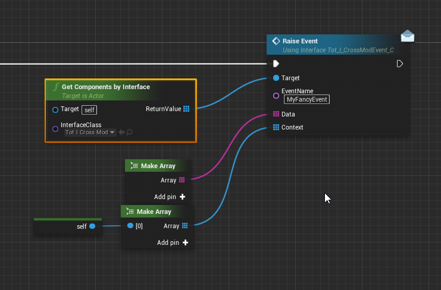

# Library resources
## Cross Mod Events <small>Tot ! Admin 0.2.0+ / Tot ! Custom 1.1.0+</small>

### Tot_I_CrossModEvent

#### RaiseEvent <small>Server</small>

Exceptionnally, it is advised to include this interface in your mod archive, to not inherit a dependancy from another mod, as it is unlikely to change at all in the futur.

To raise event on components of the same Actor or in objects part of the same context between multiple mods, I use a singular method part of a simple interface file. The method allow to transfer serialized data and/or objects for context along side a name used to identify the type of event. On the screenshot, you'll find how to very easily raise an event for other object to listen to

To receive events from this, simply implement the interface on your object, how you deal with the data you'll receive through that method is up to you.
<!-- tabs:start -->

#### **Input**

|type|name|description|
|-|-|----|
|Name|EventName||
|string|Data[]||
|Object|Context[]||

#### **Output**

void

<!-- tabs:end -->

> #### Importante note   
> In order for two mods to use this to communicate an event, it is necessary to maintain a good documentation about what data and context is expected for a given event name. If those expectations were to be changed, a good way to avoid potential critical problems would be to rename the event so that mods expecting the old data would stop raising the even util they are updated. Overall, maintaining good documentation and awareness is essential for using this system as its anonymity makes it harder to maintain

### Install instructions
> 1- Extract this into `ConanExilesDevKit\Games\ConanSandbox\Content\ModsShared\`
> **2- Do not modify any of the files in there**

**Download**: [CrossModEvents](/API/Lib.CrossModEvents.zip ':ignore')

## Math Solver <small>Not Released</small>
### Tot_C_VariableHolder
`ModsShared/SudoExile/TotLib/Types/Math/Tot_C_VariableHolder`

#### SetVariable
Set a float variable that can be used in the solving algorithm. Name of the variable does not include the $ sign used in the expression. So if in the expression you write $myvariable, you should add "myvariable". Name only allow alphabetical character and underscore and is not case sensitive.
<!-- tabs:start -->

#### **Input**

|type|name|description|
|-|-|----|
|string|Key||
|float|Value||

#### **Output**

void

<!-- tabs:end -->

#### GetVariable
Get the value of a float variable.
<!-- tabs:start -->

#### **Input**

|type|name|description|
|-|-|----|
|string|Key||

#### **Output**

|type|name|description|
|-|-|----|
|float|Return||

<!-- tabs:end -->

### Tot_I_MathSolver
`ModsShared/SudoExile/MathSolver/Tot_I_MathSolver`

**Download**: [MathSolver](/API/Lib.MathSolver.zip ':ignore')

#### Solve
Take an expression in form of a string and give a result as float. If the expression was already processed before by this solver, the cache is used to calculate the result again, even if variables are different from the previous one.  
To access the solver, use GetAllActorWithInterface. This automatically insert variables just like the scripting system from !Admin, so sudo global vars/char vars are inserted as well, allowing you to add your own variables if you wish.
<!-- tabs:start -->

#### **Input**

| type           | name             |description|
|----------------|------------------|----|
| string         | SolvedExpression ||
| ConanCharacter | OptionalPlayer    ||

#### **Output**

|type|name|description|
|-|-|----|
|float|Return||
|bool|Success||
|string|ErrorMessage||

<!-- tabs:end -->

### Supported math syntaxe

- Basic operator: + - * /
- Parenthesis with as many sub parenthesis as desired
- Discrete multiplication against parenthesis (example: 10(x - 3) would be solved as 10 * (x - 3) or (3-4)(4*5) would be (3-4)*(4*5))
- Boolean operators: and or xor not == != < <= > >=
- Boolean operators give a result of 1.0 for true and 0.0 for false. They concider any result that is not 0.0 to be true (10.0 and 1.0 = 1.0).
- Functions (number of arguments in parenthesis): abs(1) acos(1) asin(1) atan(1) atan2(2) ceil(1) clamp(3) cos(1) cosh(1) degrees(1) exp(1) floor(1) frac(1) lerp(3) log(1) log10(1) log2(1) max(2) min(2) pow(2) radians(1) round(1) rsqrt(1) saturate(1) sign(1) sin(1) sinh(1) sqrt(1) tan(1) tanh(1) trunc(1) ilerp(3)
- Variables starting with a $ sign supporting letters, numbers and underscore, not case sensitive
- Proper operator precedence: parenthesis, then multiplication and division in order, then addition and subtraction in order, then functions, then booleans.
- Expression can contain spaces for readability
