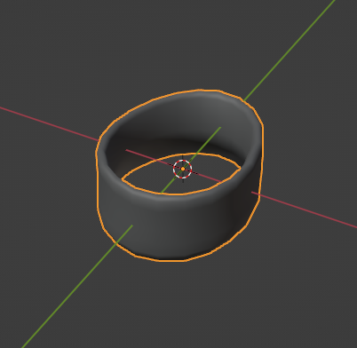
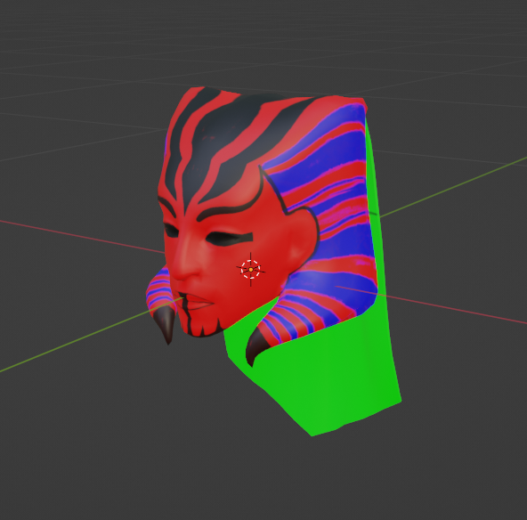
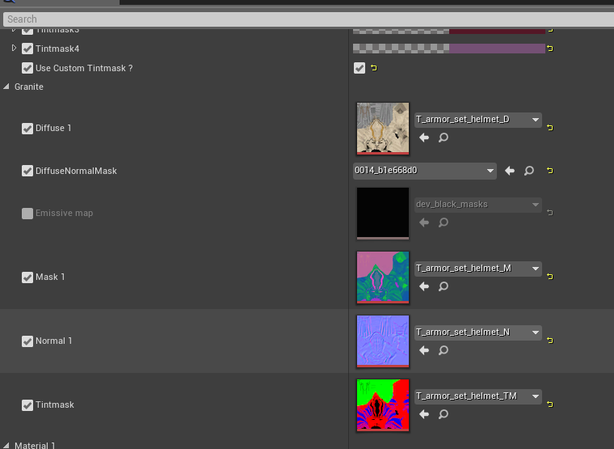

# Tot ! Custom Modeling Instructions
## Non Movable Accessories</h3>
Those are the most traditional to make, as it is just like an armor. You place a piece of mesh on the body, rig it with the skeleton import it just like an armor, and integrate it in the data tables like explained in the main API page.

## Movable Accessories

To make a good movable accessory/attachment, you need to place the model of the attachement with its pivot point on the most logical part of the model. On this screenshot, you can see that the pivot is at the center of the bracelet. Once in Custom, the move arrows will be on your pivot point. Most of movable attachments should be static ones, so no skeleton is expected. If you want to make something that move on its own, like a tail with physics, or something that could be animated with keyframes, you should rig the mesh with your own skeleton and animate like you would do for any model. Still, the pivot point should be at the most logical place of the model.

## Tint map

Tint map for attachments are exactly the same as for armors in the vanilla game if you are familliar with it. In any case, I'm going to explain it roughly. In game you can have up to 4 area per piece that can be tinted with dyes. In practice, those 4 colors correspond to the 4 channels of tintmap texture, Red, Green, Blue and Alpha. So to make a Tintmap that work in game, all you have to do is make a texture where all the red areas are affected by the first color, all the green by the second color, etc.. Using a program like Substance Painter can make this easy, but you could also do that in Blender. If you are just reporpusing armor parts from the base game, chances are the tint map are already there and you just have to use the same materials than the original armor.

When configuring your material for your piece of attachement, you might want to take example on other piece of armor of the game. The tintmap will need to be in the tintmask slot of the armor material. But again, if you are extracting base game armor, you might as well save yourself some headache and use the original armor material.

## Making a dyable/movable accessory
This is an example video of making a movable accessory, from extracting the model part from an armor, passing through making a tint map, an item icon, and the data table part for making it work with Custom. Its not a tutorial, I don't have time to explain everything, but its not a speedup thing either. So one could watch and pause the video to mimic stuff. Software used are the devkit, blender, substance painter and any image processing like gimp (just used to reframe and resize the captured image into an icon). The substance painter part could be replaced with photoshop, but I would not recommend using gimp instead, as it is maddening to export anything with gimp with proper alpha and keeping the RGB colors from collapsing into black.

<iframe width="560" height="315" src="https://www.youtube.com/embed/z52jFo_oiCw" title="YouTube video player" frameborder="0" allow="accelerometer; autoplay; clipboard-write; encrypted-media; gyroscope; picture-in-picture; web-share" allowfullscreen></iframe>