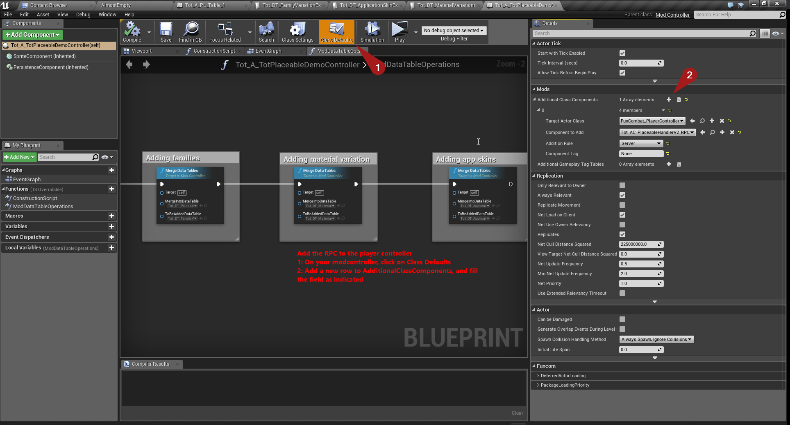
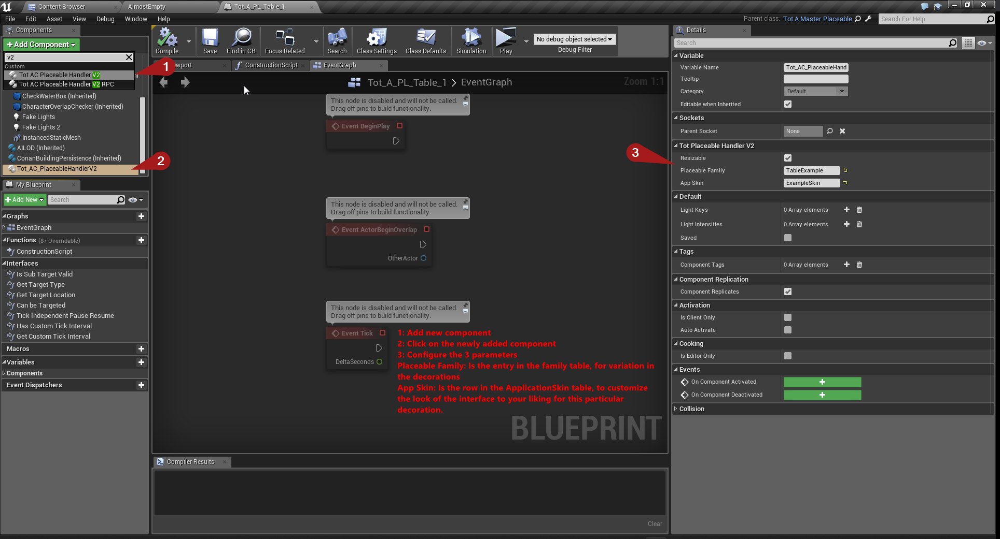
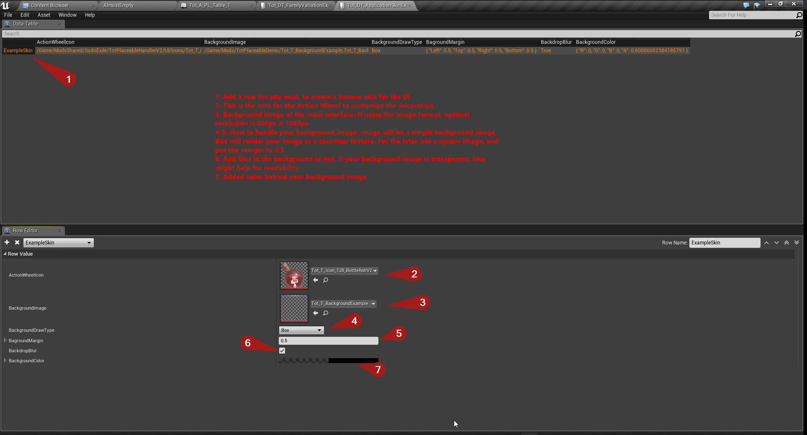
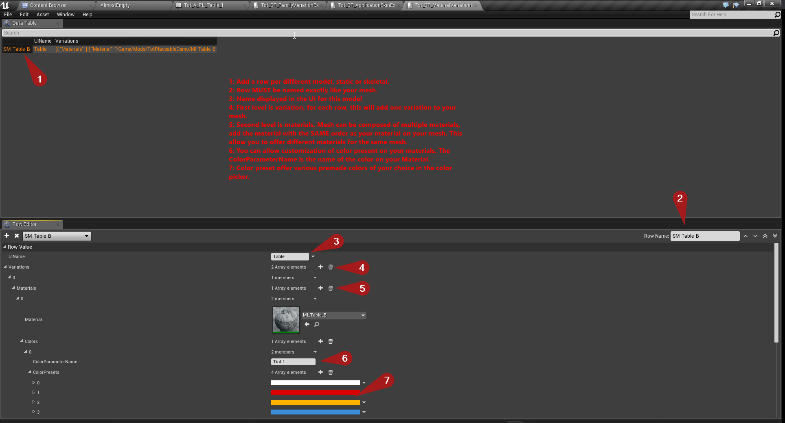
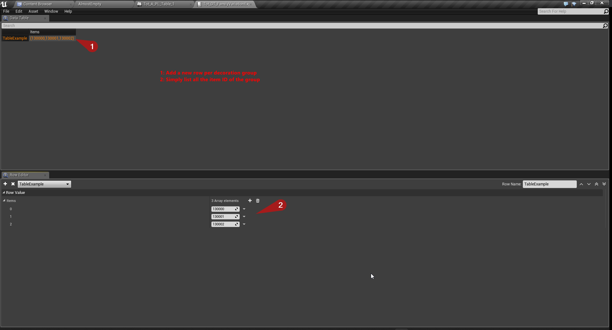

# Decoration Handler V2
## API Download

!> **Install instructions**\
1- Install Sudo API, you'll need it: [Here](sudo)   
2- Extract this into `ConanExilesDevKit\Games\ConanSandbox\Content\ModsShared\`  
3- Do not modify any of the files in there  
4- If you do not want to have a dependancy on Sudo, include the files in you modcook BUT, always inform your user that Sudo should always be under your mod.

**Download API**: [Decoration Handler 2.1.1](/API/TotPH.2.1.1.zip ':ignore')

## Initial Setup
Two things need doing on you mod after installing Sudo API and the Decoration Handler.  
- In your mod controller, merge the UIModule table of the handler to the main vanilla UIModule
- `/ModsShared/SudoExile/TotPlaceableHandlerV2/Tables/Tot_DT_PlaceableHandlerV2UIModules` > `/UI/UIModuleTable`
- Then add the RPC component to the player controller, see following screen capture

## Setup a decoration blueprint
When setting up a decoration blueprint to use the system, all you have to do is add a component and configure it:  

## Setup the various tables

Merge into the following tables. See screen captures for details about their content.
- `Tot_DT_ApplicationSkinTable` is to define how the UI is going to look, so you can customize it to you liking (Structure: `Tot_S_ApplicationSkin`)
- `Tot_DT_MaterialVariationsTable` is to add Material variations to your models. (Structure: `Tot_S_MaterialVariationRow`)
- `Tot_DT_PlaceableHandlerV2FamilyTable` is to group your decoration blueprint together to act as variations. (Structure: `Tot_S_FamilyVariationRow`)

